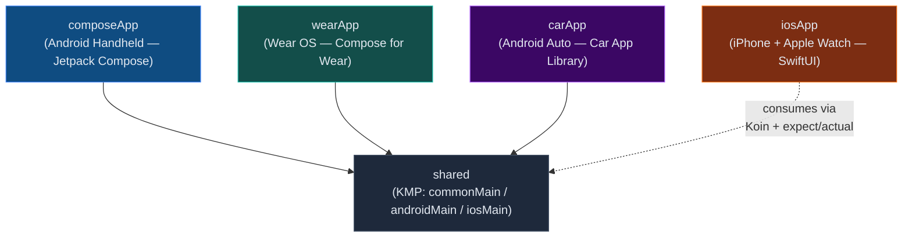
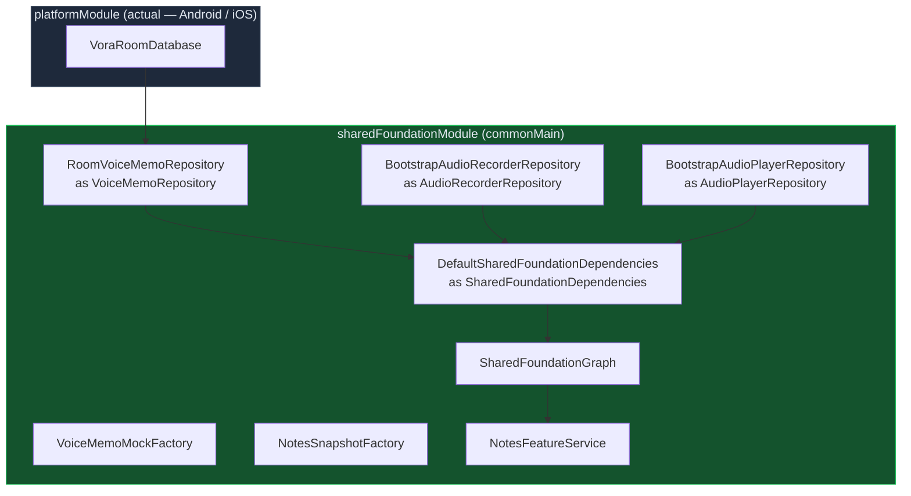
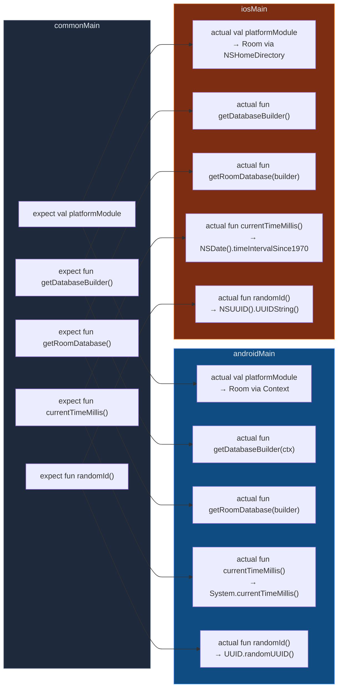

# Vora — UML Reference

All diagrams use [Mermaid](https://mermaid.js.org/) syntax.

---

## 1. Module Dependency Graph



---

## 2. Clean Architecture Layers

```mermaid
graph TD
    subgraph Presentation["Presentation Layer (per platform)"]
        VM["ViewModel / State Owner"]
        Screen["Screen / View"]
        Route["Route / Navigation"]
    end

    subgraph Domain["Domain Layer (shared — commonMain)"]
        UC["Use Cases\n(11 total)"]
        RI["Repository Interfaces\nVoiceMemoRepository\nAudioRecorderRepository\nAudioPlayerRepository"]
        DM["Domain Models\nVoiceMemo · VoiceMemoSource\nRecordingSession · CompletedRecording · PlaybackState"]
    end

    subgraph Data["Data Layer (shared — androidMain / iosMain)"]
        REPO["RoomVoiceMemoRepository\nBootstrapAudioRecorderRepository\nBootstrapAudioPlayerRepository"]
        DAO["VoiceMemoDao"]
        DB["VoraRoomDatabase\n(Room KMP)"]
        ENTITY["VoiceMemoEntity"]
    end

    subgraph Platform["Platform Layer (expect / actual)"]
        PA["getDatabaseBuilder()\ngetRoomDatabase()\ncurrentTimeMillis()\nrandomId()"]
    end

    Screen --> Route
    Route --> VM
    VM --> UC
    UC --> RI
    RI --> DM
    REPO ..|> RI
    REPO --> DAO
    DAO --> ENTITY
    DB --> DAO
    REPO --> DB
    Data --> Platform

    style Presentation fill:#0f4c81,color:#e2e8f0,stroke:#3b82f6
    style Domain fill:#14532d,color:#e2e8f0,stroke:#22c55e
    style Data fill:#3b0764,color:#e2e8f0,stroke:#a855f7
    style Platform fill:#1e293b,color:#e2e8f0,stroke:#475569
```

---

## 3. Core Class Diagram

```mermaid
classDiagram
    %% ── Domain Models ──────────────────────────────────────
    class VoiceMemo {
        +String id
        +String title
        +String audioPath
        +Long durationMs
        +Long createdAt
        +VoiceMemoSource source
        +String? transcript
    }

    class VoiceMemoSource {
        <<enumeration>>
        Phone
        Wear
        Car
    }

    class RecordingSession {
        +String tempPath
        +Long startedAt
    }

    class CompletedRecording {
        +String finalPath
        +Long durationMs
    }

    class PlaybackState {
        <<enumeration>>
        Idle
        Playing
        Paused
    }

    %% ── Repository Interfaces ───────────────────────────────
    class VoiceMemoRepository {
        <<interface>>
        +observeVoiceMemos() Flow~List~VoiceMemo~~
        +getVoiceMemo(id String) VoiceMemo?
        +upsertVoiceMemo(memo VoiceMemo)
        +renameVoiceMemo(id String, title String)
        +deleteVoiceMemo(id String)
    }

    class AudioRecorderRepository {
        <<interface>>
        +startRecording() RecordingSession
        +stopRecording() CompletedRecording
        +cancelRecording()
    }

    class AudioPlayerRepository {
        <<interface>>
        +play(memo VoiceMemo)
        +pause()
        +stop()
    }

    %% ── Use Cases ───────────────────────────────────────────
    class ObserveVoiceMemosUseCase {
        -VoiceMemoRepository repository
        +invoke() Flow~List~VoiceMemo~~
    }
    class GetVoiceMemoUseCase {
        -VoiceMemoRepository repository
        +invoke(id String) VoiceMemo?
    }
    class UpsertVoiceMemoUseCase {
        -VoiceMemoRepository repository
        +invoke(memo VoiceMemo)
    }
    class DeleteVoiceMemoUseCase {
        -VoiceMemoRepository repository
        +invoke(id String)
    }
    class RenameVoiceMemoUseCase {
        -VoiceMemoRepository repository
        +invoke(id String, title String)
    }
    class StartRecordingUseCase {
        -AudioRecorderRepository recorder
        +invoke() RecordingSession
    }
    class StopRecordingUseCase {
        -AudioRecorderRepository recorder
        +invoke() CompletedRecording
    }
    class CancelRecordingUseCase {
        -AudioRecorderRepository recorder
        +invoke()
    }
    class PlayVoiceMemoUseCase {
        -AudioPlayerRepository player
        +invoke(memo VoiceMemo)
    }
    class PausePlaybackUseCase {
        -AudioPlayerRepository player
        +invoke()
    }
    class StopPlaybackUseCase {
        -AudioPlayerRepository player
        +invoke()
    }

    %% ── Data Layer ──────────────────────────────────────────
    class VoiceMemoEntity {
        +String id
        +String title
        +String audioPath
        +Long durationMs
        +Long createdAt
        +String source
        +String? transcript
        +toDomain() VoiceMemo
    }

    class VoiceMemoDao {
        <<interface>>
        +observeAll() Flow~List~VoiceMemoEntity~~
        +getById(id String) VoiceMemoEntity?
        +upsert(entity VoiceMemoEntity)
        +rename(id String, title String)
        +delete(id String)
    }

    class VoraRoomDatabase {
        <<abstract>>
        +voiceMemoDao() VoiceMemoDao
    }

    class RoomVoiceMemoRepository {
        -VoiceMemoDao dao
    }

    class BootstrapAudioRecorderRepository {
    }

    class BootstrapAudioPlayerRepository {
    }

    %% ── DI / Feature Graph ──────────────────────────────────
    class VoiceMemoFeatureUseCases {
        +ObserveVoiceMemosUseCase observe
        +GetVoiceMemoUseCase get
        +UpsertVoiceMemoUseCase upsert
        +DeleteVoiceMemoUseCase delete
        +RenameVoiceMemoUseCase rename
        +StartRecordingUseCase startRecording
        +StopRecordingUseCase stopRecording
        +CancelRecordingUseCase cancelRecording
        +PlayVoiceMemoUseCase play
        +PausePlaybackUseCase pause
        +StopPlaybackUseCase stopPlayback
    }

    class SharedFoundationGraph {
        -SharedFoundationDependencies deps
        +VoiceMemoFeatureUseCases useCases
    }

    class SharedFoundationDependencies {
        <<interface>>
        +VoiceMemoRepository voiceMemoRepository
        +AudioRecorderRepository audioRecorderRepository
        +AudioPlayerRepository audioPlayerRepository
    }

    class NotesFeatureService {
        -VoiceMemoFeatureUseCases useCases
        +observeSnapshot() Flow~NotesSnapshot~
        +rename(id, title)
        +delete(id)
    }

    %% ── Presentation (Android) ──────────────────────────────
    class NotesViewModel {
        -NotesFeatureService service
        +uiState StateFlow~NotesUiState~
        +onRename(id, title)
        +onDelete(id)
    }

    class NotesUiState {
        +NotesScreenMode mode
        +List~NoteItem~ memos
        +List~FilterItem~ filters
        +String summaryText
        +String statusLabel
    }

    %% ── Relationships ───────────────────────────────────────
    VoiceMemo --> VoiceMemoSource

    RoomVoiceMemoRepository ..|> VoiceMemoRepository
    BootstrapAudioRecorderRepository ..|> AudioRecorderRepository
    BootstrapAudioPlayerRepository ..|> AudioPlayerRepository

    RoomVoiceMemoRepository --> VoiceMemoDao
    VoraRoomDatabase --> VoiceMemoDao
    VoiceMemoDao --> VoiceMemoEntity

    ObserveVoiceMemosUseCase --> VoiceMemoRepository
    GetVoiceMemoUseCase --> VoiceMemoRepository
    UpsertVoiceMemoUseCase --> VoiceMemoRepository
    DeleteVoiceMemoUseCase --> VoiceMemoRepository
    RenameVoiceMemoUseCase --> VoiceMemoRepository
    StartRecordingUseCase --> AudioRecorderRepository
    StopRecordingUseCase --> AudioRecorderRepository
    CancelRecordingUseCase --> AudioRecorderRepository
    PlayVoiceMemoUseCase --> AudioPlayerRepository
    PausePlaybackUseCase --> AudioPlayerRepository
    StopPlaybackUseCase --> AudioPlayerRepository

    SharedFoundationDependencies --> VoiceMemoRepository
    SharedFoundationDependencies --> AudioRecorderRepository
    SharedFoundationDependencies --> AudioPlayerRepository

    SharedFoundationGraph --> SharedFoundationDependencies
    SharedFoundationGraph --> VoiceMemoFeatureUseCases

    VoiceMemoFeatureUseCases --> ObserveVoiceMemosUseCase
    VoiceMemoFeatureUseCases --> GetVoiceMemoUseCase
    VoiceMemoFeatureUseCases --> UpsertVoiceMemoUseCase
    VoiceMemoFeatureUseCases --> DeleteVoiceMemoUseCase
    VoiceMemoFeatureUseCases --> RenameVoiceMemoUseCase
    VoiceMemoFeatureUseCases --> StartRecordingUseCase
    VoiceMemoFeatureUseCases --> StopRecordingUseCase
    VoiceMemoFeatureUseCases --> CancelRecordingUseCase
    VoiceMemoFeatureUseCases --> PlayVoiceMemoUseCase
    VoiceMemoFeatureUseCases --> PausePlaybackUseCase
    VoiceMemoFeatureUseCases --> StopPlaybackUseCase

    NotesFeatureService --> VoiceMemoFeatureUseCases
    NotesViewModel --> NotesFeatureService
    NotesViewModel --> NotesUiState
```



---

## 4. Dependency Injection Graph (Koin)



---

## 5. expect / actual — Platform Abstractions

